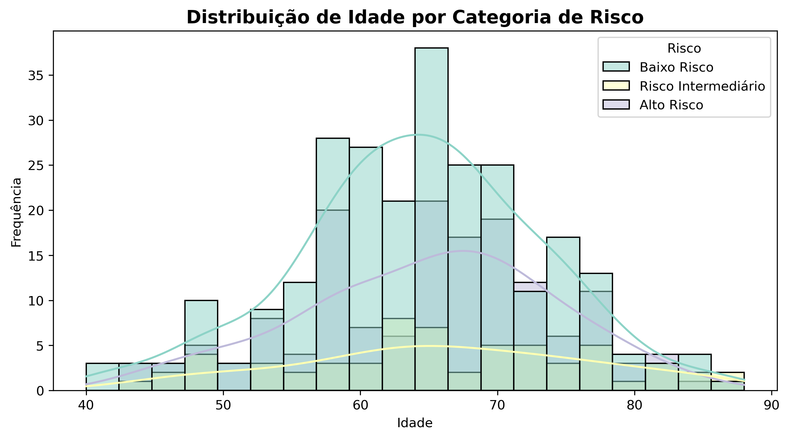
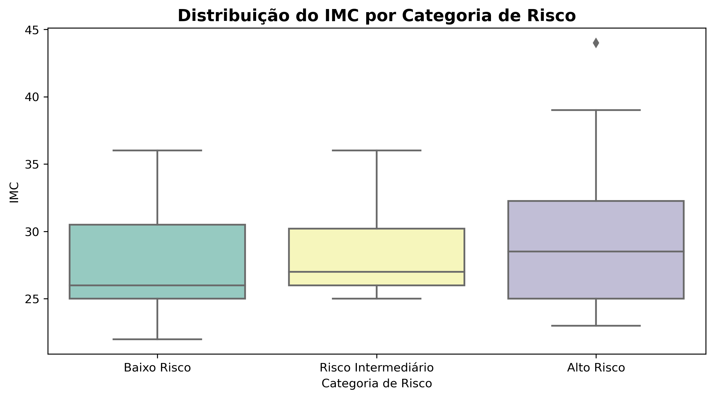
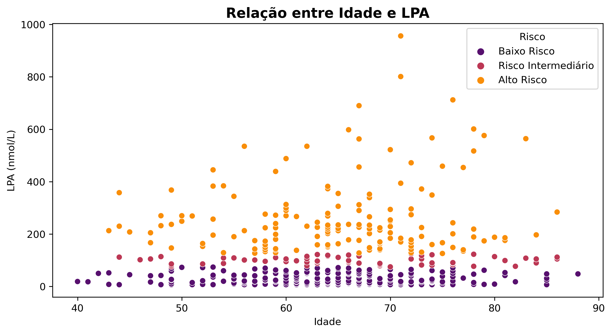

# 📊 Análise de Risco com IMC, Gênero e Idade

Este projeto foi desenvolvido a pedido da minha amiga **Bruna Lisboa**, com o objetivo de analisar dados de risco relacionados a **IMC (Índice de Massa Corporal), Gênero e Idade**, dentro das categorias de **LPA**.

## 📌 Introdução
O código processa um conjunto de dados de saúde, categorizando variáveis e gerando gráficos para visualização e análise de padrões. Os gráficos permitem entender a distribuição das variáveis dentro de diferentes **faixas de risco**, facilitando a interpretação.

## 📂 Estrutura do Código

1️⃣ **Carregamento dos Dados** – Importação do arquivo `pdlpa.csv`  
2️⃣ **Processamento e Limpeza** – Conversão de valores e categorização de variáveis  
3️⃣ **Visualização** – Geração de gráficos para interpretação dos dados  

## 📊 Gráficos Gerados

### 🔹 **Gráficos Numéricos**
1️⃣ **Histograma de Idade por Categoria de Risco**  
   - **Tipo**: Histograma  
   - **O que mostra?** A distribuição da idade dentro das faixas de risco  
   

2️⃣ **Boxplot do IMC por Categoria de Risco**  
   - **Tipo**: Boxplot  
   - **O que mostra?** A variação do IMC dentro dos grupos de risco, incluindo outliers  
    

3️⃣ **Scatterplot: Relação entre Idade e LPA**  
   - **Tipo**: Gráfico de dispersão  
   - **O que mostra?** A relação entre idade e LPA, destacando padrões por categoria de risco  
   

### 🔹 **Gráficos Categóricos**
4️⃣ **Distribuição de Variáveis por Categoria de Risco**  
   - **Tipo**: Barras empilhadas  
   - **O que mostra?** Frequência das condições de saúde (Diabetes, Hipertensão, Histórico Familiar, etc.)  
   - **Arquivos gerados**:  
      
     
     
